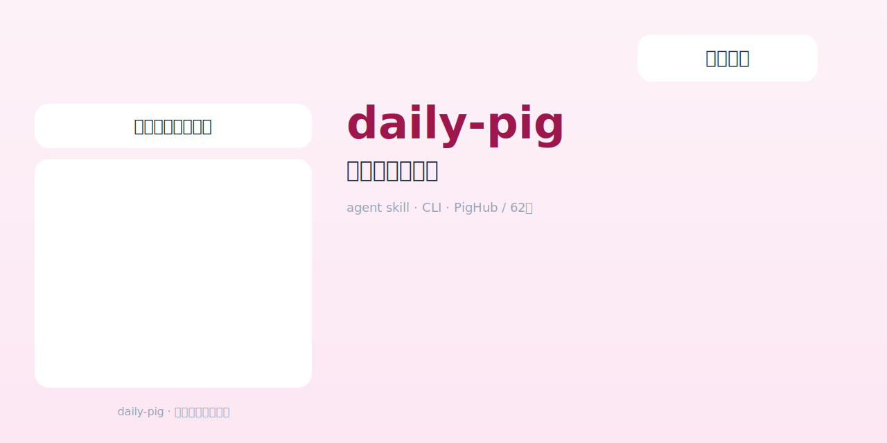
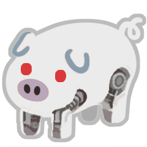
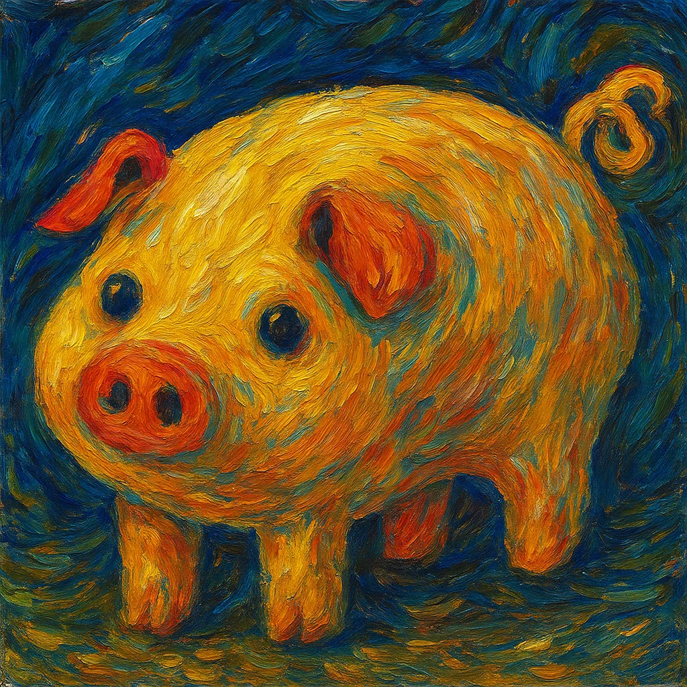
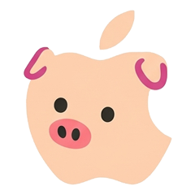
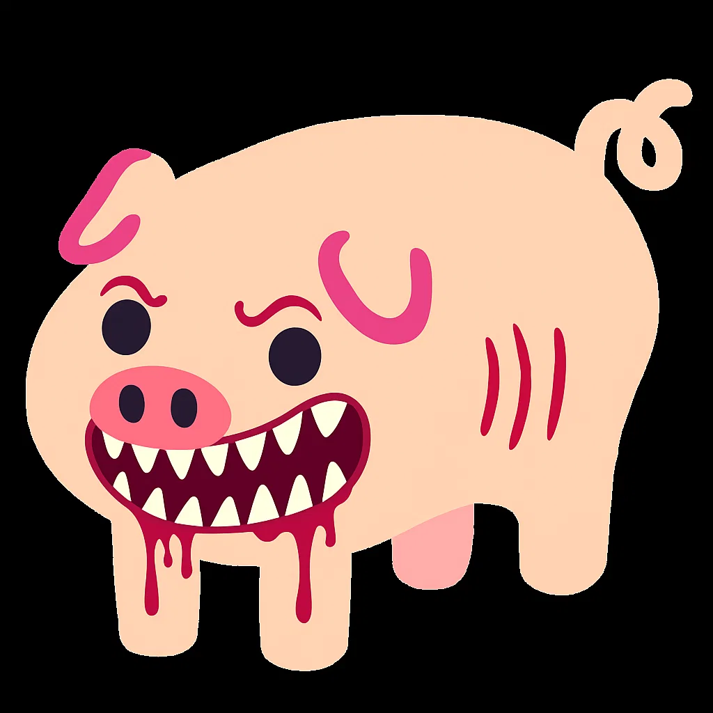

<div align="center">



# 🐖 daily-pig

### 今天是什么小猪 · Agent Skill / CLI

**对任意 AI agent 说一句「今日小猪」，或直接跑一行 Python，拿回今日限定猪图。**  
每人每天固定一只 · 默认 PigHub 大海 · 也可切回经典 62 种本地猪圈。

[](LICENSE)
[](skills/daily-pig/scripts/daily_pig.py)
[](skills/daily-pig/SKILL.md)
[](https://pighub.top)
[](skills/daily-pig/resource/pig.json)

[安装](#-安装) · [玩法](#-三句口令) · [图鉴](#-本地猪圈精选-62-种里的明星) · [致谢](#-致谢--出处--我们改了什么)

</div>

---

## 这是什么

把群聊名梗 **「今日小猪」** 做成 **agent 无关** 的 skill + 零依赖 CLI。

| 你说 / 你做 | 发生什么 |
|-------------|----------|
| **今日小猪** | 从 **PigHub** 抽今日之猪，同一用户当天结果锁定 |
| **随机小猪** | 再从 PigHub 盲抽一张（不占今日坑位） |
| **找猪 丘吉尔** | 按标题关键词搜 PigHub（最多 8 张） |
| **今日小猪（本地）** | 可选：经典 62 种，自带毒舌 `description` + `analysis` |

底层只有标准库 Python。stdout 给出文案 + 本地图片路径（`MEDIA:`）或 markdown 图链，Claude Code / Codex / OpenCode / Pi / Cursor / 其它能跑 shell 的 agent 都能接。

> 本仓库是 **移植与再包装**，不是原作者官方续作。  
> 猪圈先辈列表见文末 **[致谢](#-致谢--出处--我们改了什么)**，请先给他们点 star 🐷

---

## 🐷 三句口令

在 agent 对话里直接说：

```text
今日小猪
随机小猪
找猪 喜报
```

或自己跑：

```bash
SCRIPT="skills/daily-pig/scripts/daily_pig.py"   # 或你安装后的绝对路径

# 默认：PigHub 今日之猪（每人每天固定）
python3 "$SCRIPT" today --user alice

# 经典本地 62 种（带性格分析）
python3 "$SCRIPT" today --user alice --local

python3 "$SCRIPT" random
python3 "$SCRIPT" find 丘吉尔
python3 "$SCRIPT" refresh   # 刷新 PigHub 目录缓存
python3 "$SCRIPT" list      # 本地图鉴
```

### 输出长这样

```text
今日你是：猪克力
来源：PigHub
URL：https://pighub.top/images/...

MEDIA:/Users/you/.daily-pig/hub-images/猪克力.jpg
```

Agent 应把文案交给用户，并 **保留图片**（`MEDIA:` 路径、附件或 ``）——丢掉路径就只剩字没有猪。

---

## 🎨 本地猪圈精选（62 种里的明星）

本地模式 `today --local` / `show` 使用随仓库分发的经典 roster：

| | | | |
|:---:|:---:|:---:|:---:|
| <br>**猪**<br>普通小猪 | <br>**野猪**<br>勇猛的野猪！ | <br>**猪葛亮**<br>猪里最聪明的一个 | <br>**猪队友**<br>团灭发动机 |
| <br>**恶魔猪**<br>满肚子坏心眼 | <br>**天堂猪**<br>似了喵~ | <br>**僵尸猪**<br>喜欢的食物是猪脑 | <br>**佛猪**<br>施猪，一切随缘 |
| <br>**机械猪**<br>人机 | <br>**赛博朋克猪**<br>赛博猪猪 2077 | <br>**梵高猪**<br>星夜里的金色印象 | <br>**大色猪**<br>斯图亚特·彩虹猪 |
| <br>**坦克猪**<br>等待驾驶的重装小猪 | <br>**智慧小猪之神**<br>智慧与好运 | <br>**苹果猪** | <br>**柠檬猪** |

完整名单：`python3 …/daily_pig.py list` 或 [`skills/daily-pig/resource/pig.json`](skills/daily-pig/resource/pig.json)。

```json
{
  "id": "teammate-pig",
  "name": "猪队友",
  "description": "团灭发动机",
  "analysis": "你天生自带令人窒息的操作光环……是群聊里不可或缺的开心果。"
}
```

---

## 🌐 PigHub 大海捞猪

默认 **今日小猪** 走 [PigHub](https://pighub.top) 公开图库（目录缓存约 1000+，可 `refresh`）。

README 示意快照（版权与更新以 PigHub 为准）：

| | | | |
|:---:|:---:|:---:|:---:|
| <br>猪克力 | <br>猪理人 | <br>猪名言（丘吉尔） | <br>喜报 |
| <br>悲报（死猪） | <br>恐怖猪 | <br>猪之暗面 | <br>猪龙鱼公爵 |

```bash
python3 "$SCRIPT" refresh
python3 "$SCRIPT" find 喜报
python3 "$SCRIPT" random
```

图片地址：

```text
https://pighub.top/images/{filename}
```

（目录 JSON 里常见 `/data/...` 为逻辑路径；CLI 已改用 `/images/`。详见 [NOTICE.md](NOTICE.md)。）

---

## ✨ 主要功能

- **今日锁定**：按 `--user` 一天一只，重复抽取同一只
- **双池切换**：默认 Hub；`--local` 回到 62 + 性格分析
- **找猪 / 随机**：PigHub 搜索与盲抽
- **自动缓存**：`~/.daily-pig/`（`DAILY_PIG_HOME` 可改）
- **Agent 友好**：文案 + 本地路径 / URL + JSON trailer
- **零第三方依赖**：系统 `python3` 即可

```text
今日缓存规则
────────────
source = hub | local
同一天 + 同一 user + 同一 source → 固定
换日 或 切换 source → 重新抽
```

---

## 📦 安装

### 一键脚本（自动猜常见 skills 目录）

```bash
git clone https://github.com/anamaxlec/daily-pig.git
cd daily-pig
bash install.sh
```

默认优先装到已存在的：

| Agent 生态 | 常见路径 |
|------------|----------|
| 通用 / agents | `~/.agents/skills/daily-pig` |
| Codex | `~/.codex/skills/daily-pig` |
| Claude Code | `~/.claude/skills/daily-pig` |
| OpenCode | `~/.opencode/skills/daily-pig` |
| Hermes | `~/.hermes/skills/leisure/daily-pig` |

强制指定：

```bash
DAILY_PIG_SKILL_DIR="$HOME/.codex/skills/daily-pig" bash install.sh
```

### 手动

```bash
git clone https://github.com/anamaxlec/daily-pig.git
cp -R daily-pig/skills/daily-pig /path/to/your/skills/daily-pig
```

### 验证

```bash
python3 /path/to/daily-pig/scripts/daily_pig.py today --user test
```

对话里说 **今日小猪**。若 skill 列表有缓存，新开任务 / reload skills 后再试。

---

## 🗂 仓库结构

```text
daily-pig/
├── README.md
├── NOTICE.md                 # 上游致谢 + 修改说明
├── LICENSE
├── install.sh
├── docs/assets/
│   ├── hero.svg              # 原创头图（非上游 PigLogo）
│   ├── gallery/              # 本地明星猪展示
│   └── hub/                  # PigHub 示意快照
└── skills/daily-pig/
    ├── SKILL.md
    ├── scripts/daily_pig.py
    └── resource/
        ├── pig.json
        ├── pig_hub.json
        └── image/*.png
```

运行时状态（不进 git）：

```text
~/.daily-pig/
├── today.json
└── hub-images/
```

---

## 🛠 CLI 速查

| 命令 | 作用 |
|------|------|
| `today [--user ID]` | PigHub 今日猪（默认） |
| `today --local` | 本地 62 种 + analysis |
| `today --no-download` | Hub 模式只返回 URL |
| `random` | 再盲抽一张 Hub 图 |
| `find KEYWORD` | 搜标题，最多 8 张 |
| `refresh` | 拉最新目录 |
| `list` / `show ID` | 本地图鉴 |

环境变量：`DAILY_PIG_HOME`、`DAILY_PIG_USER`、`DAILY_PIG_SKILL_DIR`。

---

## 🙏 致谢 · 出处 · 我们改了什么

**没有这些项目，就没有这头猪。请优先 star 上游。**

| 项目 | 说明 | 链接 |
|------|------|------|
| **nonebot-plugin-rollpig** | 原始「今天是什么小猪」 | https://github.com/Bearlele/nonebot-plugin-rollpig |
| **huannai_plugin_rollpig** | 直接参考的 HoshinoBot 版 | https://github.com/SonderXiaoming/huannai_plugin_rollpig |
| **PigHub** | 在线猪图大海 | https://pighub.top |

### 相对上游的主要修改

1. 去掉 Bot 插件壳 → **独立 CLI + 可移植 `SKILL.md`**
2. **`today` 默认 PigHub**；本地 62 种为 `today --local`
3. 图片 URL：`/data/` → **`/images/`**
4. 状态目录：`~/.daily-pig/`（与具体 agent 解耦）
5. Agent 交付：`MEDIA:` + JSON trailer
6. README 头图为 **原创 SVG**，不再使用上游 `PigLogo.jpeg`

细节见 **[NOTICE.md](NOTICE.md)**。

### 版权

- 代码与本地 roster 路径遵循上游 **MIT**（[LICENSE](LICENSE)）
- PigHub 图片版权归原作者 / PigHub；`docs/assets/hub/` 仅为示意
- 本地 `resource/image` 随上游资源分发；权利人异议请开 issue
- 与原作者、PigHub **无官方隶属**

---

## 🧪 自检

```bash
python3 skills/daily-pig/scripts/daily_pig.py list | head
python3 skills/daily-pig/scripts/daily_pig.py today --user ci-test
python3 skills/daily-pig/scripts/daily_pig.py today --user ci-test   # is_repeat
python3 skills/daily-pig/scripts/daily_pig.py today --user ci-test --local
```

---

## 🗺 可能的下一步

- [ ] 定时任务：每天早上推送今日小猪
- [ ] 群聊「今日全员猪榜」
- [ ] 用户自定义本地猪 JSON / 投稿
- [ ] HTML 图鉴页

PR 与新猪投稿欢迎 —— 请写明图源。

---

<div align="center">

**今天也要开开心心做一头猪。**

<sub>Ported with 🐽 · please star the <a href="https://github.com/SonderXiaoming/huannai_plugin_rollpig">upstream pigsty</a> first</sub>

</div>
